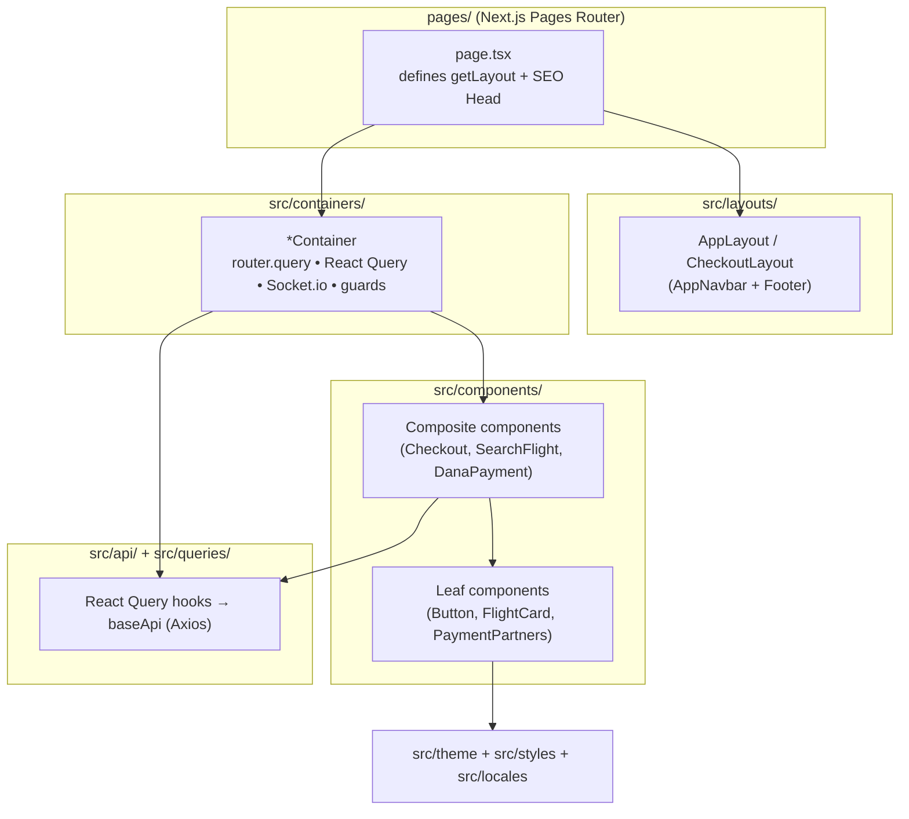

# 01 — Architecture

> Structural design of `tiket-FE`: technology stack, the Container/Component pattern, the directory map, and how Next.js pages compose containers.
> See `00-OVERVIEW.md` for scope and `02-STATE-AND-DATA.md` for the data layer.

---

## 1. Technology Stack

Ground truth: `package.json`, `pages/_app.tsx`, `next.config.mjs`, `tsconfig.json`.

| Concern | Choice | Notes |
|---|---|---|
| Framework | **Next.js 14** (`next@14.2.3`), **Pages Router** | Routes live in `pages/`. No `app/` directory. Custom `_app.tsx` and `_document.tsx`. |
| UI runtime | **React 18** | |
| Language | **TypeScript 5** | Path aliases (`@components`, `@containers`, `@api`, `@queries`, `@theme`, `@icons`, `@layouts`, `@utils`, `@hooks`, `@interfaces`) configured in `tsconfig.json`. |
| Component library | **MUI v9** (`@mui/material@^9.2.0`, `@mui/icons-material`, `@mui/x-date-pickers`) | Emotion-based styling. Theme in `src/theme/theme.ts`. `@nextui-org` has been **removed** — some component comments still reference "the old NextUI" as historical notes only. |
| Styling (hybrid) | **Tailwind CSS 3** + MUI `sx` | Tailwind utilities and MUI components coexist on the same pages. Global CSS + glass utilities in `src/styles/global.css`. Tailwind design tokens in `tailwind.config.js`. |
| Styling engine | **Emotion** (`@emotion/react`, `@emotion/styled`, `@emotion/cache`, `@emotion/server`) | SSR-safe cache created in `src/theme/createEmotionCache.ts`, injected in `_app.tsx` / `_document.tsx`. |
| Server state | **React Query v3** (`react-query@^3.39.3`) | `QueryClientProvider` + `Hydrate` in `_app.tsx`. See `02-STATE-AND-DATA.md`. |
| HTTP client | **Axios** (`src/api/baseApi`) | Single shared instance with request/response interceptors. |
| Realtime | **socket.io-client v4** | Chat + `booking:update` events. |
| Forms | **react-hook-form** + **yup** + `@hookform/resolvers/yup` | Mandatory for multi-field booking forms. |
| i18n | **i18next** + **react-i18next** (`intl-pluralrules`) | `id` (default) / `en`. Setup in `src/utils/i18n/`. |
| Dates | **moment** + `@mui/x-date-pickers` `AdapterMoment` | `LocalizationProvider` wraps the app in `_app.tsx`. |
| Animation | **framer-motion** | Page/section transitions, `Button` micro-interactions. |
| Misc | `qrcode.react` (chatbot QRIS card), `react-toastify` (global toasts), `react-error-boundary`, `react-intersection-observer` (infinite scroll), `swiper`, `react-markdown` + `remark-gfm` (chat rendering), `react-country-flag` (language switcher). |

### `_app.tsx` provider stack

`pages/_app.tsx` wires the global providers, in order:

```
CacheProvider (Emotion)
└─ ThemeProvider (MUI theme.ts) + CssBaseline
   └─ LocalizationProvider (AdapterMoment)
      └─ QueryClientProvider (defaultQueryOption)
         └─ Hydrate (React Query SSR state)
            └─ QueryErrorResetBoundary → ErrorBoundary (react-error-boundary)
               ├─ ReactQueryDevtools
               ├─ getLayout(<Component />)   ← per-page layout
               └─ <ChatBot />                ← global, always mounted
```

`_app.tsx` also opens a global Socket.io connection on mount purely to emit `visitor_connected`; feature-specific socket subscriptions are opened locally by the containers/hooks that need them.

## 2. The Container vs Component Pattern

Ground truth: `docs/COMPONENTS_AND_UI.md`, `src/containers/*`, `src/components/*`.

The codebase enforces a two-tier separation of concerns:

- **`src/containers/` — page-level views.** A container is mounted by exactly one Next.js page. It reads `router.query`, invokes React Query hooks and `useMutation`, opens Socket.io subscriptions, performs navigation guards, and orchestrates side effects. Containers own *behaviour and data*. Examples: `FlightListContainer` (search query, filtering, infinite scroll, navigation), `EticketContainer` (booking query + `booking:update` subscription), `PaymentContainer` (booking query + DANA handoff).
- **`src/components/` — reusable UI elements.** Components are presentational or hold only localized UI state (a toggle, a controlled input). They do **not** fetch server data. Examples: `FlightCard`, `DanaPayment`, `PaymentPartners`, `AppNavbar`. Multi-field forms (`Checkout`, `SearchFlight`) live here and own their `react-hook-form` instance, but receive their data (e.g. the selected flight) as props from a container.

> Nuance observed in code: the boundary is pragmatic rather than absolute. Some components in `src/components/` do call APIs directly — e.g. `Checkout` runs `useMutation(bookFlight)`, `CarRentalForm` posts to `/api/car-rental/rent`, `SearchFlight` runs `useQueryGetAirports`. The reliable invariant is the directory role: **containers are 1:1 with pages; components are the composable building blocks pages/containers assemble.**

### Component layering diagram



## 3. Directory Map

```
tiket-FE/
├── pages/                     # Next.js Pages Router — one file per route
│   ├── _app.tsx               # Global providers, layouts, global socket, ChatBot
│   ├── _document.tsx          # Emotion SSR, <html lang>, document shell
│   ├── index.tsx              # Home (flight search)  → HomeContainer
│   ├── flights/index.tsx      # Flight results        → FlightListContainer
│   ├── checkout/index.tsx     # Checkout              → CheckoutContainer
│   ├── checkout/payment/…     # Payment + confirm/failed/success/waiting
│   ├── eticket/index.tsx      # Flight e-ticket       → EticketContainer
│   ├── ferry/…                # find, index, list, passenger, payment, success, failed
│   ├── car-rent/…, car-rental/…  # Car search + rental form
│   ├── dana-transaction-status.tsx  # DANA PAY_RETURN → DanaTransactionStatusContainer
│   ├── history/, profile/     # Bookings history, profile
│   └── 404.tsx, offline.tsx
├── src/
│   ├── containers/            # Page-level views (data + side effects)
│   ├── components/            # Reusable UI (forms, cards, navbar, payment, chatbot)
│   │   ├── Button/            # Design-system Button wrapper over MUI Button
│   │   ├── Payment/           # DanaPayment + summary/status sub-views
│   │   ├── ChatBot/           # Widget, useChatSocket hook, ChatMessage renderer
│   │   └── …
│   ├── api/                   # Axios clients per domain
│   │   ├── baseApi/           # Shared Axios instance + getApiUrl + error normalization
│   │   ├── dana/              # DANA create-order client
│   │   ├── searchFlights/, bookFlight/, ferry/, carRental/, airports/, airlines/
│   ├── queries/              # React Query hooks (flights, ferry, airports, airlines, bookFlight)
│   ├── constants/queryKey.ts  # React Query key constants
│   ├── theme/                 # MUI theme.ts + createEmotionCache.ts
│   ├── styles/global.css      # Tailwind layers + .glass-card/.glass-navbar utilities
│   ├── locales/               # i18n JSON grouped by domain (en.json / id.json)
│   ├── utils/i18n/            # i18next init + translation assembly
│   ├── layouts/               # AppLayout, CheckoutLayout
│   ├── hooks/common/          # useMetaTags, etc.
│   ├── icons/                 # Brand + payment (Dana, BankBni, BankBri, BankMandiri) SVG icons
│   └── types/                 # Shared TS interfaces (@interfaces)
├── theme via tailwind.config.js, postcss.config.js
└── docs/                      # Legacy narrative docs (COMPONENTS_AND_UI, STATE_AND_QUERIES, RESPONSIVE, AI_CHATBOT)
```

## 4. How Pages Compose Containers

Every route file follows the same composition contract (reference: `pages/index.tsx`, `pages/flights/index.tsx`, `pages/eticket/index.tsx`):

1. The page is typed `NextPageWithLayout` and renders `<Head>` SEO tags (via `useMetaTags` / `buildSeoTags`) plus **one container**.
2. The page attaches a static `getLayout` that wraps the container in a layout — almost always `AppLayout` (navbar + footer). `_app.tsx` calls `Component.getLayout ?? (page => page)`.
3. Data-heavy result/flow pages additionally wrap the container in a `react-error-boundary` `ErrorBoundary` with `ContainerError` as the fallback (e.g. `/flights`, `/ferry/list`, `/car-rent`).

```tsx
// pages/flights/index.tsx (shape)
const FlightListPage: NextPageWithLayout = () => (
  <>
    <Head>{buildSeoTags(seoTags)}</Head>
    <ErrorBoundary FallbackComponent={ContainerError}>
      <FlightListContainer />
    </ErrorBoundary>
  </>
);
FlightListPage.getLayout = (page) => <AppLayout>{page}</AppLayout>;
```

Pages carry **no** business logic beyond SEO + layout + error-boundary selection; all behaviour lives in the container. This keeps routing declarative and makes the container the single unit of feature behaviour.
