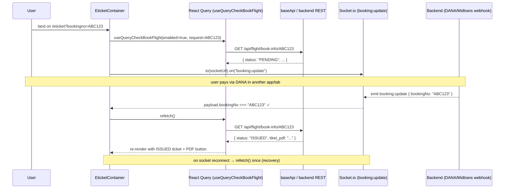

# 02 — State & Data Layer

> How `tiket-FE` fetches, caches, and synchronizes server state: React Query, the shared Axios client, the hard no-`refetchInterval` rule, and the Socket.io + query integration.
> See `01-ARCHITECTURE.md` for where these live and `04-USER-FLOWS.md` for how they drive each flow. Grounded in `src/api/*`, `src/queries/*`, `docs/STATE_AND_QUERIES.md`.

---

## 1. React Query Configuration

Server state is managed by **React Query v3**. The `QueryClient` is created once in `pages/_app.tsx` with the shared `defaultQueryOption` from `src/api/baseApi`:

```ts
// src/api/baseApi/index.ts
export const defaultQueryOption = {
  defaultOptions: {
    queries: {
      retry: false,               // no automatic retries — fail fast, surface via toast
      refetchOnWindowFocus: false // no refetch storm when the tab regains focus
    },
  },
};
```

`Hydrate` wraps the tree to rehydrate any SSR-dehydrated query state from `pageProps.dehydratedState`.

### Query key convention

Keys are centralized in `src/constants/queryKey.ts`:

```ts
export const GET_FLIGHTS_KEY        = 'flights';
export const GET_FLIGHT_PRICES      = 'flightPrices';
export const GET_CHECK_BOOK_FLIGHT  = 'checkBookFlight';
export const GET_AIRLINES_KEY       = 'airlines';
export const GET_AIRPORTS_KEY       = 'airports';
export const SEARCH_AIRPORTS_KEY    = (search: string) => `searchAirports/${search}`;
```

Hooks compose keys as arrays of `{ key, payload }` objects so the payload (e.g. a booking code or search request) participates in cache identity — see `useQueryCheckBookFlight` below.

## 2. Hook Registry

Data-fetching hooks live under `src/queries/`, one folder per domain; each wraps a client function from the matching `src/api/<domain>/` folder.

| Hook | File | Backing API call | Purpose |
|---|---|---|---|
| `useQuerySearchFlights({ request, enabled })` | `queries/flights/useQuerySearchFlights.ts` | `searchFlights` → `POST` flight search | Flight results for a `{ departure, arrival, departureDate, adult, child, infant }` request. Used by `FlightListContainer` (outbound, return, and each multi-city segment) and `CheckoutContainer`. |
| `useQueryCheckBookFlight({ request, enabled, onSuccess })` | `queries/bookFlight/useQueryCheckBookFlight.ts` | `checkBookFlight(bookingCode)` → `GET /api/flight/book-info/:code` | Full booking record (status, nominal, passengers, `flightdetail`, `tiket_pdf`). Reference realtime consumer; used by `PaymentContainer` and `EticketContainer`. |
| `useQueryGetAirports({ enabled })` | `queries/airports/useQueryGetAirports.ts` | `getAirports` | Airport list for search dropdowns. |
| `useQuerySearchAirports(search)` | `queries/airports/useQuerySearchAirports.ts` | search airports by string | Typeahead airport search. |
| `useQueryGetAirlines()` | `queries/airlines/useQueryGetAirlines.ts` | `getAirlines` | Airline metadata. |
| `useQueryFerrySectors()` | `queries/ferry/index.ts` | ferry sectors | Origin/destination sectors for the ferry search form. |
| `useQueryFerryRoutes({ searchString?, sectorID?, pageIndex?, pageSize? })` | `queries/ferry/index.ts` | ferry routes | Routes, filterable by sector. |
| `useQuerySearchFerryTrips({ embarkation, destination, tripdate }, options?)` | `queries/ferry/index.ts` | ferry trip schedules | Trip schedules for `FerryListContainer` (outbound + return). `tripdate` is `YYYYMMDD`. |

### Non-React-Query fetches (imperative)

Not all reads go through React Query. Some flows call the Axios clients imperatively inside `useEffect`/handlers and hold results in local `useState`:

- **`bookFlight`** — invoked via `useMutation(bookFlight)` in `Checkout` (mutation, not query).
- **Car rental** — `searchCars` / `getCarById` (`src/api/carRental`) called directly in `CarRentContainer` and `CarRentalFormContainer`.
- **Ferry booking** — `reserveFerryBooking`, `submitFerryBooking`, `getFerryBooking` (`src/api/ferry`) called directly in `FerryPassengerContainer` / `FerryPaymentContainer`.
- **DANA** — `createDanaOrder` (`src/api/dana`) called on the Pay-now handler in `DanaPayment` (see `05-PAYMENTS.md`).

## 3. Shared Axios Client & Error Normalization

Ground truth: `src/api/baseApi/index.ts`, `src/api/baseApi/types.ts`.

All HTTP goes through a single Axios instance (`baseAPI`) with a **90-second timeout**. Two design points:

### Dynamic base URL (`getApiUrl`)

The base URL is resolved **at request time** by a request interceptor, not baked in at module load (which would be wrong under SSR):

```ts
baseAPI.interceptors.request.use((config) => {
  config.baseURL = getApiUrl();
  return config;
});
```

`getApiUrl()` returns:
- `http://localhost:3001` when the browser hostname is local (`localhost`, `127.0.0.1`, `192.168.*`, `10.*`);
- otherwise `process.env.NEXT_PUBLIC_API_URL`, falling back to `https://api.tiketq.com`.

The **Socket.io URL is derived from the same `getApiUrl()`** by stripping the path to the origin — every socket consumer repeats this `new URL(apiUrl).origin` pattern (`_app.tsx`, `EticketContainer`, `DanaPayment`, `DanaTransactionStatusContainer`, `useChatSocket`).

### Response/error handling

- **Success helper** `handleDefaultSuccess({ data }) => data` unwraps the Axios envelope.
- **Error helper** `handleDefaultError` re-throws `error.response.data` (the server's error body) so callers catch a normalized shape (`{ errors?, message?, tokenExpired? }`, typed as `DefaultError<T>`).
- **Global response interceptor** shows a dark bottom-right `react-toastify` toast on network/unreachable errors (`!error.response || code === 'ERR_NETWORK'`) — "Unable to connect to the server…" — then rejects. Non-network errors pass through to the caller for local handling (usually a `toast.error(err.message)`).

## 4. The Hard Rule: No `refetchInterval`

Polling is **prohibited** across the codebase (`docs/STATE_AND_QUERIES.md`). No query in `src/queries/` sets `refetchInterval`. The rationale: a polled query on the e-ticket page would re-mount the full-page spinner every interval and hammer the provider.

```ts
// ❌ Forbidden
useQuery(key, fetcher, { refetchInterval: 30_000 });

// ✅ Required — realtime push triggers a manual refetch
const { data, refetch } = useQuery(key, fetcher, { enabled });
```

Status changes are delivered by **Socket.io `booking:update` pushes**, which trigger a targeted `refetch()` or a navigation. This applies equally to queries triggered from the navbar and menus.

## 5. Socket.io + Query Integration

The backend emits `booking:update` with a `{ bookingNo }` payload when a booking's payment/issuance status changes (Midtrans/DANA webhook → DB → emit; see the repo-root `CLAUDE.md` and `tiketq-bosbiller` docs). Three consumers subscribe:

- **`EticketContainer`** — on a matching `booking:update`, calls `refetch()` to pull the freshest booking (which may now be `ISSUED` with a `tiket_pdf`).
- **`DanaPayment`** — on a matching `booking:update`, **navigates** the user to `successPath` (default `/eticket`, `/ferry/success` for ferry).
- **`DanaTransactionStatusContainer`** — the DANA PAY_RETURN landing; on a matching `booking:update`, navigates to `/eticket`.

Every consumer **filters by booking number** (`payload.bookingNo === bookingno`) so unrelated pushes are ignored.

### Reconnect recovery

Mobile users leave the tab to pay in the bank/DANA app; the socket can drop and a `booking:update` fire while backgrounded. To recover without polling:

- `EticketContainer` attaches `socket.io.on('reconnect', refetch)` — one re-pull on reconnect.
- `DanaPayment` and `DanaTransactionStatusContainer` rely on socket.io keeping the `booking:update` listener attached across reconnects (so any update emitted *after* reconnect still routes the user forward). Both also expose manual "View my ticket" fallbacks for the case where the event was delivered while away.

> This is **push-based recovery, not polling** — the reconnect handler fires at most once per reconnect. The no-`refetchInterval` rule holds.

### Sequence — the socket + query update path (e-ticket)


