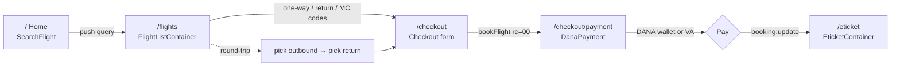
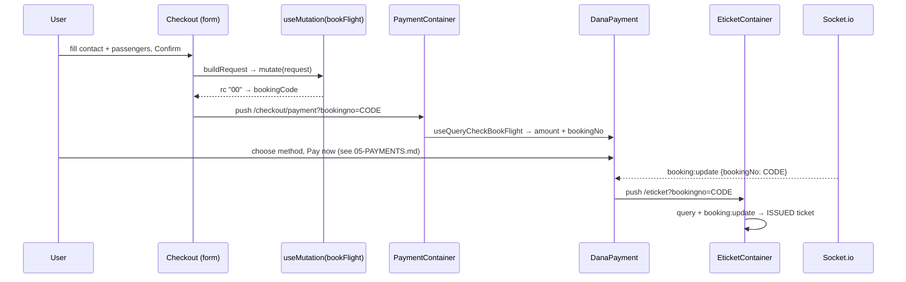
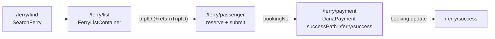
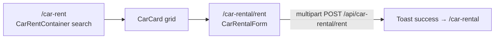

# 04 — User Flows

> End-to-end booking journeys for flights, ferries, and car rentals, with the containers/components that own each step.
> See `02-STATE-AND-DATA.md` for the data hooks and `05-PAYMENTS.md` for the payment step. State is carried between steps almost entirely through **URL query strings** (`router.query`), not global state.

---

## 1. Flight Flow

### Steps & ownership

| Step | Route | Container / Component | Key behaviour |
|---|---|---|---|
| Search | `/` | `HomeContainer` → `SearchFlight` | Trip-type tabs (one-way / round-trip / multi-city up to 4 segments); `react-hook-form` form; airports from `useQueryGetAirports`; `DatePicker`. On submit, pushes `/flights?...` with all params. |
| Results | `/flights` | `FlightListContainer` | `useQuerySearchFlights` for outbound (+ a second query for the return leg when round-trip, + one per multi-city segment). Client-side airline/transit filter, price sort, and infinite scroll (`react-intersection-observer`, `PAGE_SIZE = 10`). |
| Select | `/flights` | `FlightCard` | For round-trip, first click sets `selectedOutboundCode` and re-renders the return list; the return selection pushes to `/checkout`. Multi-city collects one code per segment then pushes all codes. |
| Checkout | `/checkout` | `CheckoutContainer` → `Checkout` | Re-runs `useQuerySearchFlights` and finds the fare by `searchId === code`. Two tabs — **Order** (contact + passengers) and **Review**. `react-hook-form` + `yup`. Confirm dialog → `useMutation(bookFlight)`. |
| Payment | `/checkout/payment` | `PaymentContainer` → `DanaPayment` | `useQueryCheckBookFlight` loads the booking; `DanaPayment` renders the DANA picker (see `05-PAYMENTS.md`). |
| E-ticket | `/eticket` | `EticketContainer` | `useQueryCheckBookFlight` + `booking:update` subscription; renders route, passengers, status badge, PDF/print actions when `ISSUED`. |

### Search form (`SearchFlight`) — validation & submit

The form uses `react-hook-form` with a `yup` resolver (`src/components/Checkout/forms/useForm.ts` for checkout; `SearchFlight/forms/useForm.ts` for search). Trip type is a `watch`ed field driving conditional return-date and multi-city UI. Submit builds a `Record<string,string>` query and `router.push({ pathname: '/flights', query })`.

### Planned enhancement — International search toggle

**Status: planned, not yet implemented.** Today the airport/destination set is scoped to Indonesian domestic hubs to keep the dataset small (the backend `routes/api/flight/airports` route prioritizes ~10 ID hubs; the flight provider supports international but it was filtered out for size). This enhancement adds opt-in international search:

- **Toggle control** — a **"International"** toggle on the flight `SearchFlight` form. Default **off** = domestic (Indonesia) only, preserving today's behavior. When **on**, the search includes international destinations and flights as well (the provider already supports this), so results are **ALL** = domestic + international.
- **Airport dropdown grouping** — when the toggle is active, the origin/destination airport dropdown is split into two labelled sections with a visual separator: **Domestic** and **International**. The sections stack **vertically** (Domestic group first, then a separator, then International). When the toggle is off, only the Domestic group is shown (current behavior).
- **Data source** — flight results already carry an `isInternational` flag (`src/api/searchFlights/types.ts`), which can drive result labelling; airports need a domestic/international classification (from the provider or a maintained list) to populate the two dropdown groups.
- **Backend** — the airports route (and the flight-search provider request) must stop scoping to domestic when the toggle is on; expect a larger airport payload, so keep the Redis cache and consider paginating/typeahead (`/api/flight/search-airport/:q`) for the international set.

### Checkout data collection & booking

`Checkout` (`src/components/Checkout/index.tsx`) is a `FormProvider`-wrapped multi-tab form:

- On `flightData` arrival it `methods.reset(...)`, generating one passenger sub-form per adult/child/infant (`generatePassengers`). The `yup` schema requires contact (`firstname`, `lastname`, `email` [format-validated], `phone`) and per-passenger fields (`firstname`, `lastname`, `call`, `date_of_birth`, `cabinClass`).
- Tab switching calls `methods.trigger()` and only advances if valid.
- Confirm opens a glass `Dialog`; confirming runs `handleSubmit(onSubmit)` → `buildRequest(data)` → `mutate(request)`.
- **Double-submit guard:** a `searchId` is single-use at the provider (a re-book returns rc 44). An `isBookingRef` ref plus the mutation's `isLoading` guard against rapid clicks. On `data.rc === "00"` it pushes `/checkout/payment?bookingno=<bookingCode>`; otherwise it re-opens the guard and toasts the error.

### Round-trip nuance

`FlightListContainer` runs two `useQuerySearchFlights` calls — outbound (`from→to`, `date`) and return (`to→from`, `returnDate`). `handleSelect` stores the first pick in `selectedOutboundCode` and swaps the list to the return leg; `handleSelectReturn` pushes both `code` (outbound) and `returnCode` (return) to `/checkout`.

### Flight checkout → e-ticket sequence

## 2. Ferry Flow

Ferry has its own container chain (no shared checkout with flights). Contact/passenger state here uses **local `useState`**, not `react-hook-form` (a divergence from the flight flow — see `07-NON-FUNCTIONAL.md`).

| Step | Route | Container | Behaviour |
|---|---|---|---|
| Search | `/ferry`, `/ferry/find` | `FerryFindContainer` → `SearchFerry` | Sector/date search; ferry + payment partner logos shown. |
| Results | `/ferry/list` | `FerryListContainer` | `useQuerySearchFerryTrips` (outbound + return); trip selection pushes `/ferry/passenger` with `tripID` (and `returnTripID` for round trips). |
| Passengers | `/ferry/passenger` | `FerryPassengerContainer` | Per-passenger passport fields + contact block (email, confirmation email, mobile, WhatsApp), all local state with manual validation via `toast`. On Next: `reserveFerryBooking(payload)` then immediately `submitFerryBooking({ id, emailConfirmation })`, then push `/ferry/payment` with `bookingNo`, `price`, terminals, `vesselName`, `contactEmail`. Dates normalized `YYYYMMDD → YYYY-MM-DD`. |
| Payment | `/ferry/payment` | `FerryPaymentContainer` → `DanaPayment` | Loads booking via `getFerryBooking(bookingNo)` (graceful fallback to URL params). Renders `DanaPayment` with `successPath="/ferry/success"`. |
| Success | `/ferry/success` | `FerrySuccessContainer` | Static confirmation card (step indicator + "payment received"). **Note:** currently static — it does not read a live booking or a socket; it displays a hardcoded order number placeholder. Flagged as a gap in `07-NON-FUNCTIONAL.md`. |

## 3. Car Rental Flow

Car rental is a **request/lead**, not an instantly-issued ticket — there is no DANA payment step.

| Step | Route | Container / Component | Behaviour |
|---|---|---|---|
| Search | `/car-rent`, `/car-rental` | `CarRentContainer` | Local-state hero search (rental date, car type, seat rows); `searchCars(...)` → `CarCard` grid. Batam-only copy. |
| Details / form | `/car-rental/rent` | `CarRentalFormContainer` → `CarRentalForm` | Loads the car by id (via `searchCars` + find). The form collects personal details, phone (`type="tel"`), email (`type="email"`), rental duration (`type="number"`), and **two required image uploads (KTP photo + KTP selfie)** as `multipart/form-data`. |
| Submit | — | `CarRentalForm` | Manual validation via `toast`; posts `multipart/form-data` to `POST /api/car-rental/rent` through `baseApi`. On success: success toast + `router.push('/car-rental')`. No payment, no e-ticket — ops follows up ("We will contact you shortly"). |

## 4. E-Ticket Delivery via `booking:update`

For flight and ferry, the ticket is not delivered synchronously at "Pay now". The user pays via DANA (redirect or VA transfer); the backend confirms payment out-of-band and emits `booking:update`. The frontend advances on that push (see `02-STATE-AND-DATA.md` §5):

- **DANA return:** the DANA app redirects to `/dana-transaction-status?bookingno=<code>` (`DanaTransactionStatusContainer`), a "checking payment…" screen that forwards to `/eticket` on the matching `booking:update`.
- **In-place:** if the user stayed on `DanaPayment` (e.g. a VA transfer), that component also subscribes and navigates on the push.
- **E-ticket:** `EticketContainer` refetches on the push and renders the issued ticket (route table, passenger table, PDF via `window.open` of a base64 blob, and `window.print()`), with a manual "View my ticket" fallback for missed events.
