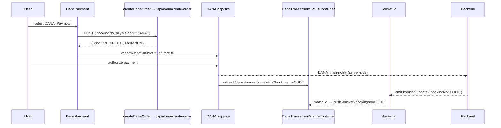
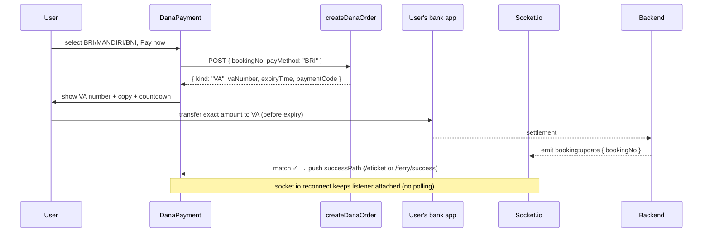

# 05 — Payments (DANA)

> The payment UI specification. `tiket-FE` is **DANA-only** — DANA e-wallet plus BNI/BRI/MANDIRI virtual accounts. There is no Midtrans Snap, no client-key env var, and no QRIS in checkout.
> Grounded in `src/components/Payment/DanaPayment.tsx`, `src/api/dana/index.ts`, `src/components/PaymentPartners/index.tsx`, `src/containers/PaymentContainer`, `src/containers/FerryPaymentContainer`, `src/containers/DanaTransactionStatusContainer`, `pages/dana-transaction-status.tsx`. See `02-STATE-AND-DATA.md` for the realtime mechanics and `04-USER-FLOWS.md` for where payment sits in each flow.

---

## 1. The Payment Picker (`Payment/DanaPayment.tsx`)

`DanaPayment` is a reusable component rendered by both `PaymentContainer` (flight) and `FerryPaymentContainer` (ferry).

### Props

```ts
interface Props {
  bookingNo?: string;   // flight bookingCode or ferry bookingNo
  amount: number;       // IDR, display-only — the server re-prices from the booking
  isLoading?: boolean;
  successPath?: string; // where to go on confirmed payment; default "/eticket"
}
```

The amount is **display-only**; `createDanaOrder` sends only the booking number and method, and the backend derives the real amount from the stored booking. Amount is formatted with `Intl.NumberFormat("id-ID", { currency: "IDR" })`.

### Methods offered

```ts
const METHODS = [
  { key: "DANA",    label: "DANA",                    Icon: Dana },
  { key: "BRI",     label: "BRI Virtual Account",     Icon: BankBri },
  { key: "MANDIRI", label: "Mandiri Virtual Account", Icon: BankMandiri },
  { key: "BNI",     label: "BNI Virtual Account",     Icon: BankBni },
];
```

- Rendered as an MUI `RadioGroup`; each row shows the **same brand logo icon used on the home page** (`src/icons/Dana`, `BankBri`, `BankMandiri`, `BankBni`) at 44×44.
- **BCA is intentionally omitted** — not enabled for the DANA merchant.
- **QRIS is not offered in checkout.** (The chatbot's inline payment card still has a QRIS branch — see `06-AI-CHATBOT.md`; that is a separate surface.)
- Default selected method is `DANA`.

The same four logos appear on the home/ferry landing pages via `PaymentPartners` (`src/components/PaymentPartners/index.tsx`) — a grayscale-until-hover row of Dana/BRI/Mandiri/BNI at 60×60.

### Two response kinds

`DanaPaymentResponse.kind` discriminates the two payment experiences:

| `kind` | Method(s) | UI behaviour |
|---|---|---|
| `REDIRECT` | DANA wallet | `window.location.href = redirectUrl` — the browser leaves the app for the DANA app/site to authorize. |
| `VA` | BRI / MANDIRI / BNI | Renders a copyable virtual-account number (`payment.vaNumber`) with a copy `IconButton` (`navigator.clipboard`) and a live expiry countdown. |

### "Pay now" handler

```ts
const handlePay = async () => {
  // isSubmittingRef guards against double submit
  const result = await createDanaOrder(bookingNo, method);
  if (result?.kind === "REDIRECT" && result.redirectUrl) {
    window.location.href = result.redirectUrl;   // DANA wallet
    return;
  }
  if (!result?.paymentCode) { toast.error(...); return; }
  setPayment(result);                             // VA → show instructions view
};
```

An `isSubmittingRef` ref plus `isProcessing` state prevent duplicate orders from rapid clicks. On failure a `react-toastify` error toast is shown.

### VA instructions view

Once a VA order exists, the component renders a "Complete your payment" card: total, expiry countdown (`m:ss`, turns red at 0 with an "expired, start again" message), the mono-formatted VA number with copy button, a "transfer the exact amount" note, and a "Change payment method" ghost button that clears `payment` back to the picker.

### Auto-advance on confirmation

`DanaPayment` opens a Socket.io connection and subscribes to `booking:update`. On a payload whose `bookingNo` matches, it navigates to `successPath` (`/eticket` for flights, `/ferry/success` for ferry) — **no polling** (per `02-STATE-AND-DATA.md`). It relies on socket.io keeping the listener attached across reconnects for flaky mobile networks.

## 2. Create-Order API Client (`src/api/dana/index.ts`)

```ts
export type DanaPayMethod = "DANA" | "BNI" | "BRI" | "MANDIRI" | "CIMB" | "PANIN";

export interface DanaPaymentResponse {
  method: DanaPayMethod;
  kind: "VA" | "REDIRECT";
  vaNumber: string | null;
  redirectUrl: string | null;   // present for DANA wallet
  paymentCode: string | null;
  expiryTime: string | null;
  referenceNo: string | null;
  bookingNo: string;
}

export const createDanaOrder = (bookingNo: string, payMethod: DanaPayMethod) =>
  baseAPI.post<DanaPaymentResponse>("/api/dana/create-order", { bookingNo, payMethod })
    .then(handleDefaultSuccess).catch(handleDefaultError);
```

> The type union declares `CIMB`/`PANIN` as valid backend methods, but the checkout picker only surfaces `DANA/BRI/MANDIRI/BNI` (§1). Errors are normalized by the shared `handleDefaultError` (throws `error.response.data`); the picker surfaces `err.message` via toast.

## 3. DANA PAY_RETURN Landing (`/dana-transaction-status`)

New return page for the DANA wallet redirect flow. After the user authorizes in the DANA app, DANA sends them to `/dana-transaction-status?bookingno=<code>`.

- **Page:** `pages/dana-transaction-status.tsx` — wraps `DanaTransactionStatusContainer` in `AppLayout` with SEO tags.
- **Container:** `src/containers/DanaTransactionStatusContainer/index.tsx` — a glass "Checking your payment…" card with a spinner. It subscribes to `booking:update` and, on a matching `bookingNo`, `router.push('/eticket?bookingno=<code>')`.
- **Manual fallbacks** (for an event delivered while the user was away): a `component={Link}` "View my ticket" button to `/eticket?bookingno=…` and a "Home" ghost link — both use the link-based navigation rule (`03-DESIGN-SYSTEM-AND-UI.md`).

## 4. Sequence Diagrams

### DANA wallet (REDIRECT)



### Virtual Account (VA)


