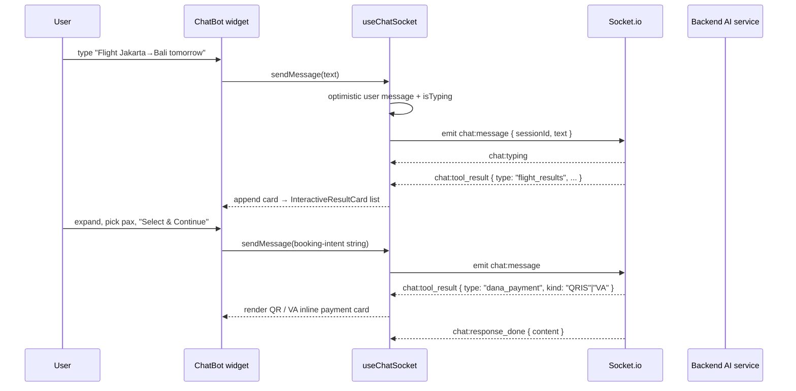

# 06 — AI Chatbot

> The embedded AI booking assistant: the `useChatSocket` hook, the Socket.io chat protocol, and how `ChatMessage` renders each tool-result card.
> Grounded in `src/components/ChatBot/index.tsx`, `src/components/ChatBot/useChatSocket.ts`, `src/components/ChatBot/ChatMessage.tsx`, `docs/AI_CHATBOT.md`. The chatbot is mounted globally in `pages/_app.tsx`, so it is available on every page.

---

## 1. Widget (`ChatBot/index.tsx`)

A fixed bottom-right floating widget: `fixed bottom-4 right-4 sm:bottom-6 sm:right-6 z-[999]`. A FAB toggles `isOpen` between a `MessageCircle` (closed) and `X` (open) icon; when closed a small promo bubble (`common.ai_bubble`) invites use. Open state renders a chat panel: a scrollable message list (`ChatMessage` per message, auto-scrolled on new messages / typing), a typing indicator driven by `isTyping`, and an input (`placeholder="Type your message..."`) whose submit calls `sendMessage(inputValue)`. All server communication is via `useChatSocket` — there are **no REST calls** in the chatbot.

## 2. `useChatSocket` Hook

### Connection & session

- Opens one Socket.io connection **once per component mount** (empty-dep `useEffect`), to the origin derived from `getApiUrl()` (same `new URL(apiUrl).origin` pattern as the rest of the app — see `02-STATE-AND-DATA.md`).
- Generates a **session id once per mount**, not per message: `sessionIdRef = "session-" + Math.random().toString(36).substring(2, 9)`. Every outbound message carries this id so the backend can maintain conversation state.
- Disconnects on unmount.

### Chat protocol (Socket.io events)

| Direction | Event | Payload | Effect |
|---|---|---|---|
| → server | `chat:message` | `{ sessionId, text }` | Sent by `sendMessage`; also optimistically appends the user's message and sets `isTyping`. |
| ← client | `chat:typing` | — | `setIsTyping(true)` |
| ← client | `chat:response_done` | `{ content }` | Clears typing; appends an assistant text message (if `content`). |
| ← client | `chat:tool_result` | `ToolResultData` | Clears typing; appends an assistant message with empty `content` and a `toolResult` payload (rendered as a rich card by `ChatMessage`). |
| ← client | `chat:error` | `{ message }` | Clears typing; appends an `Error: …` assistant message. |

### State shape

```ts
type Message = {
  id: string;
  role: "user" | "assistant";
  content: string;
  toolResult?: ToolResultData; // present only for rich UI cards
};
```

The hook seeds a bilingual (EN/ID) welcome message and returns `{ messages, isTyping, sendMessage }`.

### Tool-result discriminated union

```ts
export type ToolResultData =
  | { type: "flight_results"; data: { options?: FlightOption[]; cheapest?; earliest?; latest?; message? } }
  | { type: "ferry_results";  data: { options?: FerryOption[];  cheapest?; earliest?; latest?; message? } }
  | { type: "booking_summary"; data: { bookingCode?; status?; error?; flightdetail?: FlightDetail[] } }
  | { type: "dana_payment"; data: { bookingCode; kind: "QRIS" | "VA"; vaNumber: string|null; qrContent: string|null; expiryTime: string|null } }
  | { type: "customer_service_card"; data: Record<string, never> };
```

`FlightOption`, `FerryOption`, and `FlightDetail` are also declared in `useChatSocket.ts`. The legacy `'booking_form'` / `'qris_payment'` member names no longer exist.

## 3. `ChatMessage` Rendering

`ChatMessage.tsx` renders plain assistant/user text via `react-markdown` (+ `remark-gfm`), and switches on `message.toolResult.type` for rich cards:

| `type` | Rendered card |
|---|---|
| `flight_results` / `ferry_results` | One `InteractiveResultCard` per option. Cards expand to pick Adults/Children/Infants, then call `sendMessage(...)` with a pre-written booking-intent string (see below). `cheapest`/`earliest`/`latest` are shown de-duplicated by `searchId`. |
| `booking_summary` | Booking code + status badge + route from `flightdetail[0]`; if `data.error`, a red error card instead. |
| `dana_payment` | Inline payment card. **`kind: "QRIS"`** → a `QRCodeSVG` (from `qrcode.react`) rendered from `data.qrContent` at size 200. **`kind: "VA"`** → a copyable virtual-account number from `data.vaNumber` with a "transfer the exact amount" note. |
| `customer_service_card` | Static WhatsApp card; CTA links to `https://wa.me/6282382709777`. |

### `InteractiveResultCard` confirm-message format

Selecting an option emits a natural-language booking intent back into the conversation, which drives the AI's booking-data-collection flow:

```
I want to book the {label} {flight|ferry} ({airline|ferryName}) departing at {departTime}
  [on {departDate}] for {adults} Adult(s), {children} Child(ren), and {infants} Infant(s).
```

### Chatbot payment vs checkout payment

The chatbot's `dana_payment` card is **rendered inline by `ChatMessage`** with no Midtrans Snap and no client key. It is a **separate surface** from the main checkout `DanaPayment` (`05-PAYMENTS.md`): unlike checkout, the chatbot card **still supports a QRIS branch** in addition to VA. This QRIS/checkout divergence is intentional and current.

## 4. Chatbot Flow



## 5. Localization

Promo/marketing copy for the widget is localized in `src/locales/common/{en,id}.json` (`common.ai_promo_title`, `common.ai_promo_banner_title/desc/example_flight/example_ferry`, `common.ai_bubble`). See `07-NON-FUNCTIONAL.md` for the i18n system.
